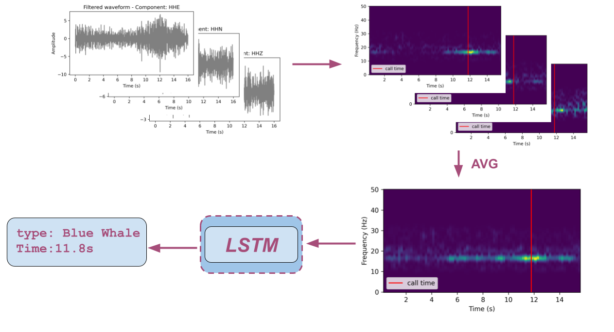

[](https://github.com/mila-aia/ner/blob/main/LICENSE)
[](https://www.python.org)
[](https://github.com/pre-commit/pre-commit)
[](https://github.com/psf/black)
[](http://mypy-lang.org/)
[](https://github.com/mila-aia/whale-call-detection/actions/workflows/ci_pipeline.yml)

# Whale Call Detection 
[__Overview__](#overview)
| [__Setup__](#setup)
| [__Data__](#data)
| [__Usage__](#usage)
| [__Licenses__](#licenses)

## Overview
This repository implements a framework to detect whale calls embedded in seismic waveforms. Based on seismic waveform spectrogram, the algorithm performs the following two tasks: 
1. recognizing the presence of whale calls (*classification task*) 
2. predicting call time if recognized (*regression task*).
<div align="center">
    
    <div>
    Figure 1. An overview of the framework. The seismic data shown here is a sample of a blue whale call detected on station PMAQ and the timestamp of this call is '2021-10-02 07:13:33.02'. The waveform has been filtered with a  band pass filter [10, 32] HZ.</div>
</div>

## Setup

### Installation
1. Download and install the latest [Anaconda Python distribution](https://www.anaconda.com/distribution/#download-section)
2. Download and uncompress the repository [here](https://github.com/mila-aia/whale-call-detection/archive/refs/heads/main.zip).
3. Execute the following commands to install all software requirements:
```
cd whale-call-detection
conda env create
pip install --editable .
```

3. (Optional) Install pre-commits hooks:
```
cd whale-call-detection
conda activate whale
pre-commit install
```
### Installation (Docker)
1. Download and install [docker](https://www.docker.com/).
2. Execute the following commands to install all software requirements to a Docker image:
```
cd whale-call-detection
docker build -t whale-call-detection .
```
The following commands will mount the current source code and provide access to the docker container's terminal:
```
cd whale-call-detection
docker run -it --rm \
    -v `pwd`:/home/whale-call-detection \
    -p 5000:5000 \
    -p 8888:8888 \
    whale-call-detection \
    /bin/bash
```
### Using the GPU from inside the Docker container
To use the GPU from within the Docker container, make sure to install [nvidia-docker](https://github.com/NVIDIA/nvidia-docker) and set the Docker `runtime` to `nvidia`. For example:
```
cd whale-call-detection
docker run -it --rm --runtime=nvidia \
    -v `pwd`:/home/whale-call-detection \
    -p 5000:5000 \
    -p 8888:8888 \
    whale-call-detection \
    /bin/bash
```

## Data
The raw seismic data used in this study is publicly available via Natural Resoures Canada's FTP server: `ftp://ftp.seismo.nrcan.gc.ca/`. The labels (blue and fin whale calls) are generated using the algorithm and code developed by [Plourde and Nedimovic [2022]](https://d197for5662m48.cloudfront.net/documents/publicationstatus/118893/preprint_pdf/1fb191babdbd9d518829ce1e5282a4bd.pdf). For more details on data availability and preprocesing, please check this [documentation](docs/data.md).

The directory format of processed waveform data is:
```
├── root_data_dir/
│   ├── 20200201/
│   │   ├── 2021.06.06.CN.CNQ..EHZ.SAC
        ├── 2021.06.06.CN.ICQ..HHE.SAC
        ├── ...
│   ├── 20200202/
│   │   ├── 2020.02.02.CN.CNQ..EHZ.SAC
        ├──2020.02.02.CN.ICQ..HHE.SAC
        ├── ...
│   ├── ...
│   │
```
The format of directory used to initialize an instance of `WhaleDataModule` is:
```
├── root_data_dir/
    ├── train.csv
    ├── valid.csv
    ├── test.csv
```

Here is the dataset dictionary:

Column | Explanation | Type | Example
--- | --- | --- | ----|
`file_path`|path to the `.SAC` file with its `component` replaced with `CHANNEL` | `str`| `/root_data_dir/20210822/2021.08.22.CN.SNFQ..CHANNEL.SAC`
`time_window_start` | signal window start time |`str`| `2021-08-22 05:56:45.38`
`time_window_end` | signal window end time | `str`|`2021-08-22 05:57:01.38`
`time_R_max` | target call time, i.e. the time with the maximum whale index (R) value |`str`| `2021-08-22 05:56:54.01`
`time_call_start` | the start time of a whale call ($\sim$ 1s for fin whale calls and $\sim$ 8s for blue whale calls) |`str`| `2021-08-22 05:56:50.01`
`time_call_end` | the end time of a whale call ($\sim$ 1s for fin whale calls and $\sim$ 8s for blue whale calls)  | `str`|`2021-08-22 05:56:58.01`
`R` | the whale call index value (fixed as `0.0` for noise samples) | `float`|`19.7`
`SNR` | the signal-to-noise ratio of the whale call (fixed as `-99.0` for noise samples | `float` |`21.22`
`station_code` | station where the signal is detected | `str` | `SNFQ`
`whale_type` | type of signal (`0` for noise samples and `1` for a whale call | `int` | 1
`component` | list of components separated by space available for given station | `str` | `HHE HHN HHZ`

### Split
To split the dataset into `train`, `validation` and `test` datasets we have developped a script `scripts/split_data.py`.

```
python scripts/split_data.py -h
usage: split_data.py [-h] [--input-file INPUT_FILE] [--output-path OUTPUT_PATH]
Script to apply bandpass filter to a list of SAC files
optional arguments:
  -h, --help            show this help message and exit
  --input-file INPUT_FILE
                        Path to dataset (.csv) (default: data/LABELS/FW/MIXED/fw_HQ_component_grouped_filt.csv)
  --output-path OUTPUT_PATH
                        Path to output folder. (default: data/datasets/FWC_HQ_3CH_FILT/)
```

The dataset is split into 3 subsets using the same random seed: 80\% for the training set, 10\% for the validation set, and 10\% for the test set.

## Usage
### Training
To train a Long shot-term memory (LSTM) network, please check [LSTM](docs/lstm.md) for more details. Samples of labels for training can be found [here](https://drive.google.com/file/d/1nf9p9E32nu6WYc0nP5LrCHLbwOkxPBfC/view?usp=sharing). Please note that raw waveform data is not included and can be downloaded following instructions in [data.md](docs/data.md).

### Making predictions 
To make prediction using a trained model (available [here](https://drive.google.com/file/d/1nZSO-n1fA14krLMt8Qa-XATC5PJWeMQs/view?usp=sharing)): 

```
python scripts/predict.py -h
usage: predict.py [-h] [--model-ckpt MODEL_CKPT] [--inp-csv INP_CSV] [--out-csv OUT_CSV]
                  [--batch-size BATCH_SIZE]

Make prediction using a pretrained model

optional arguments:
  -h, --help            show this help message and exit
  --model-ckpt MODEL_CKPT
                        path to the pretrained model checkpoint (default: model.ckpt)
  --inp-csv INP_CSV     path to the input csv file (default: samples.csv)
  --out-csv OUT_CSV     path to the predictions csv file (default: predictions.csv)
  --batch-size BATCH_SIZE
                        batch size for prediction (default: 16)
```
The `samples.csv` has 4 columns: [`file_path`,`time_window_start`,`time_window_end`,`component`].
\
The `predictions.csv` has 6 columns: [ `file_path`,`time_window_start`,`time_window_end`,`component`,`label_pred`,`time_pred`].


### Comet experiment logging
Experiments are tracked using `comet`. 
\
Please check this [quickstart](https://www.comet.com/docs/v2/guides/getting-started/quickstart/) for more details on setup `comet`.
\
The hisory of experiments can be then visualized in your online Comet dashboard.

### Consulting Optuna logs
Optuna logs from a `optuna.sqlite3` database located in the current directory can be consulted as follow:
```
optuna-dashboard sqlite:///optuna.sqlite3
```
Otherwise, Optuna logs can be consulted as follow:
```
optuna-dashboard sqlite:///ABSOLUTE_PATH_TO_OPTUNA.SQLITE3_FILE
```

## Licenses
### Models
Not applicable as no pre-trained modes are used.

### Datasets
- The seismograph data is licensed under the [Open Government License - Canada](https://open.canada.ca/en/open-government-licence-canada).

### Packages

Package | Version | License
--- | --- | ---
optuna|3.1.0|MIT License
optuna-dashboard|0.10.0| MIT License
pandas | 1.4.3  | BSD 3-Clause License
transformers | 4.20.1 | Apache 2.0 License
torchaudio | 0.12.1 | BSD 2-Clause License
torch | 1.12.1 | BSD 3-Clause License
pytorch_lightning | 1.9.2 | Apache2.0
plotly | 5.9.0 | MIT License
obspy|1.3.0 | LGPL v3.0
matplotlib | 3.6.3 | [Customized License](https://github.com/matplotlib/matplotlib/blob/main/LICENSE/LICENSE)
wget | 3.2 | GNU General Public License
types-pyyam | 6.0.12.6 | Apache 2.0 license
jsonargparse[signatures]| 4.20.0 | MIT License
wandb | 0.15.8 | MIT License

