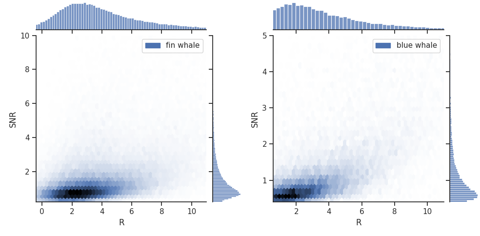
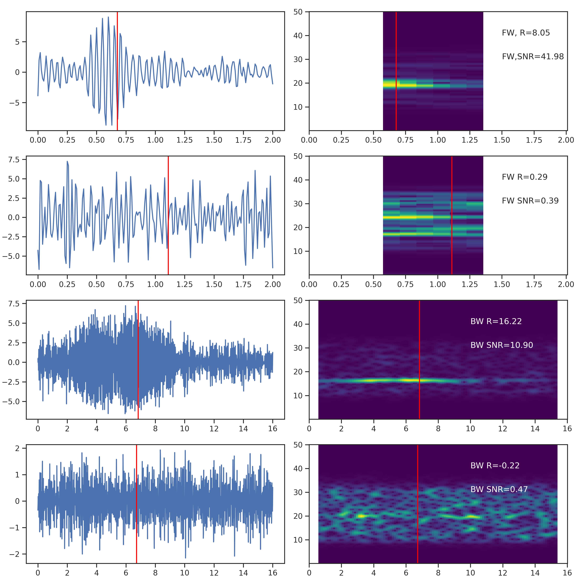

# Overview
This project uses Deep Learning techniques to detection the presence of whale calls using public onshore seismograph data, which is publicy available via [Canadian National Seismograph Network (CNSN)](https://earthquakescanada.nrcan.gc.ca/stndon/CNSN-RNSC/index-en.php). We focus on the call detections of the endangered species of Blue Whales and Fin Whales in the Lower St-Lawrence Seaway. Taking waveform spectrogram as the input, the algorithm can simultaneously: 1) recognize the presence of whale calls; and 2) predict its time if a call is recognized. 

# Data
## Preparation
We retrieved daily seismic waveform data from February 2020 to January 2022 from Natural Resoures Canada's FTP server: `ftp://ftp.seismo.nrcan.gc.ca/`. Six land seismometers in the LSLS were selected: RISQ (Rimouski), CNQ (Côte-Nord), SNFQ (Sainte-Félicité), ICQ (Islets-Carribou), SMQ (St-Marguerite) and PMAQ (Port Menier Anticosti). All these seismometers have one vertical and two horizontal components, except for CNQ and SMQ which only have a vertical component. All seismometers have a sampling rate of 100 Hz.  Instrument response was not removed as the response curve within the frequency range of interest (10Hz to 32Hz) is almost flat (see [investigate_instrument_response.ipynb](../notebooks/investigate_instrument_response.ipynb)).

To prepare the data for model training and evaluation, we first filtered the raw waveform using a band-pass filter (10 Hz to 32 Hz). Then we constructed two distinct datasets, one tailored for fin whale call recognition and another for blue whale call recognition. Each dataset consists of $50\%$ positive and $50\%$ negative samples. For the fin whale call dataset, each positive sample is the spectrogram of a 2s waveform containing a fin whale call and each negative sample is the spectrogram of a 2s waveform containing only noise signal. The spectrogram was calculated with a window size of 0.5s and an overlapping window of 0.45s. For stations with multiple channels, we take the average of the spectrograms of different channels. The blue whale call dataset has the same configuration except its longer sample length of 16s. The sample length is determined based on the observation that, on average, a fin whale call has a duration of 1s ([Roy et al. 2018](https://waves-vagues.dfo-mpo.gc.ca/library-bibliotheque/40803612.pdf)) and a blue whale call has a duration of 8s ([Mellinger and Clark, 2003](https://pubs.aip.org/asa/jasa/article-abstract/114/2/1108/547725/Blue-whale-Balaenoptera-musculus-sounds-from-the)). For each positive sample in both datasets, the whale call is randomly located within the time window of interest. In total, the fin whale call dataset has 186,359 samples and the blue whale call dataset has 51,537 samples. Both datasets are then partitoned into three splits: training ($80\%$), validation ($10\%$) and testing ($10\%$).

## Data quality
The data quality can be determined using two parameters: the whale index value $R$ and signal-noise-ratio $SNR$ (detailed definition can be found in [[Plourde and Nedimovic, 2022](https://d197for5662m48.cloudfront.net/documents/publicationstatus/118893/preprint_pdf/1fb191babdbd9d518829ce1e5282a4bd.pdf)]).  Figure 1 shows distribution of $R$ and $SNR$ values. 

    
    

    Figure 1. Histograms and scatter plots of R and SNR values of two datasets. For easier visualization, the values are truncated between 2.5% and 97.5% quantiles. 

A higher $R$ and a higher $SNR$ indicates a higher data quality, as illustrated by examples in Figure 2.

    
    

    Figure 2. Random whale call examples at different quality level. 

# Methodology

The neural architecture used is the LSTM with 3-layers of recurrent networks and a hidden size of 128. 

    
    

    Figure 3. An overview of the framework. The seismic data shown here is a sample of a blue whale call detected on station PMAQ and the timestamp of this call is '2021-10-02 07:13:33.02'. The waveform has been filtered with a  band pass filter [10, 32] HZ.

A final linear layer is used to project the last hidden state of the LSRM into the target. The target is a joint task of a binary classification task on discriminating postive and negative examples and a regression task on predicting call time. The loss function to be minimized is:

$$L=L_{cls}+\lambda I_{y_{pred}=1} L_{reg}$$

where $L_{cls}$ is the binary cross-entropy loss, $L_{reg}$ is the $L_1$, $I_{y_{pred}=1}$ is the indicator function and $\lambda$ is the weighting factor, which is set to 0.5 in the experiment. The model is trained for 30 epochs with a batch size of 64 using AdamW with a learning rate of $1e^{-3}$.

Models are eveluated using accuracy for binary classification task and mean-absolute-error (MAE) for call time regression task.

# Experiments and Results
The dataset contains annotation at different quality levels, as determined by $R$ and $SNR$ values. When $R$ and $SNR$ are too low, the whale call detected is not distinguishable from noise data and the call time is not clearly visible on the spectrogram (Figure 2).  We investigate the influence of this factor by training model on datasets at different quality levels (Table 1). For fin whale dataset, we created a filtered dataset (named as FW1) with $R > 5$ and $SNR > 5$, resulting in 16,092 samples. Since the same filtering threshold on blue whale calls reduces the number of samples to only 1,205 (dataset named as BW2), we created one additional filtered dataset (named as BW1) with $R > 3$ and $SNR > 1$ resulting in 16,092 samples. 

For fin whale call recognition, when comparing the model trained on the unfiltered dataset FW0 to the model trained on FW1, it is observed that the latter achieves a comparable performance in the regression task while manifesting a notable improvement in its prediction accuracy, with a marked increase from 0.792 to 0.973. For blue whale call recognition, the results indicate a direct correlation between improved data quality and enhanced classification performance. In the meantime, the performance in the regression task remains relatively consistent, with the exception that the MAE of the model trained on BW2 deteriorates to 1.82s, which is more than 2x higher than other models. This discrepancy suggests that the dataset BW2, despite its superior data quality among the datasets, may possess insufficient volume for reliable call time prediction.

| Dataset | Name  | Data Quality Filtering | Size | Accuracy | MAE|
| --------|--| ------- |--------| -------- | ------- 
| fin whale call | FW0| No filtering   |186,359|0.792|0.09s|
| fin whale call | FW1| $R$ > 5 and  $SNR$ > 5   |11,565|0.973|0.08s|
| blue whale call|  BW0| No filtering   |51,537|0.829|0.81s|
| blue whale call|  BW1| $R$ > 3 and  $SNR$ > 1   |16,092|0.938|0.86s|
| blue whale call|  BW2| $R$ > 5 and  $SNR$ > 5   | 1,205|0.959|1.82s|